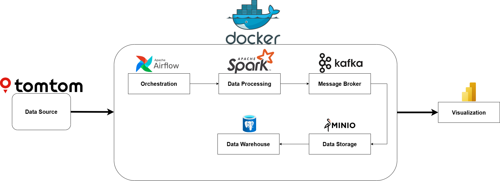
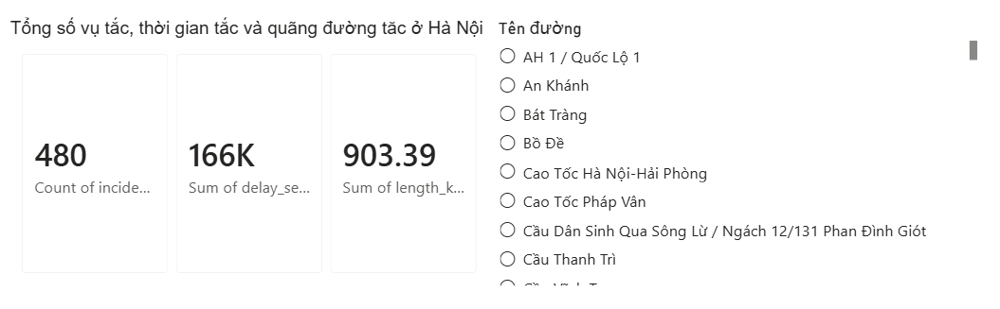
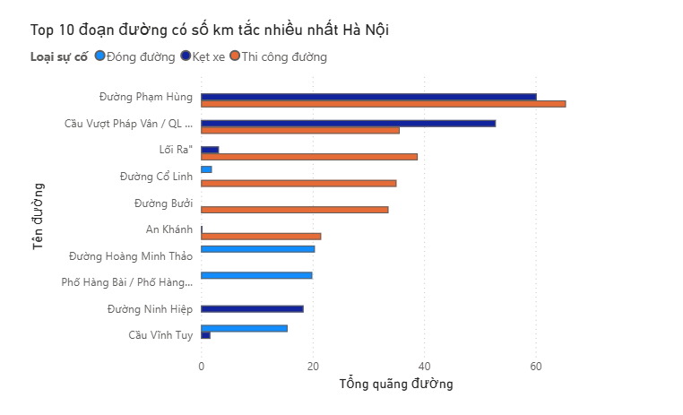
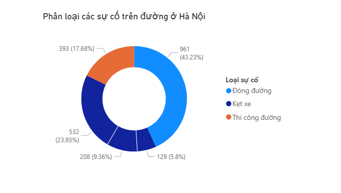

# Realtime Traffic Congestion Analytics (Hanoi)
### An end-to-end Realtime Big Data streaming pipeline designed to ingest, process, and analyze live traffic congestion and accident data in Hanoi. The system continuously polls the TomTom Traffic API, processes the high-velocity data using distributed streaming technologies, and persists actionable insights into a relational database for downstream visualization and monitoring.

# Architecture



# Tech Stack

| Ingredients | Technology | Role |
|-----------|-----------|---------|
| Orchestration | Apache Airflow | Schedule and monitor data pipeline |
| Containerization | Docker & Docker Compose | Local deployment of Kafka, Spark, PostgreSQL |
| Data Source | TomTom Traffic API | Provide realtime traffic incident data |
| Stream Processing | Apache Spark Structured Streaming | Process and analyze streaming data |
| Message Broker | Apache Kafka | Ingest and stream data |
| Data Storage | MinIO | Store `raw_incidents`|
| Warehouse | PostgreSQL 15 | Store staging and data mart |
| Visualization | Power BI | Dashboard and Visualization |
| Program Language | Python 3.11 | Create logic |

# Folder Structure

```bash
├── dags
│   └── airflow_dags.py
├── docker
│   └── init.sql
├── images
│   ├── architecture.png
│   ├── image (3).png
│   ├── image-1.png
│   ├── image-2.png
│   └── image.png
├── sql
│   └── init.sql
├── src
│   ├── core
│   │   ├── config.py
│   │   └── logger.py
│   ├── infrastructure
│   │   ├── minio_client.py
│   │   └── postgres_client.py
│   └── producer
│       └── api_producer.py
├── .env.example
├── .gitignore
├── README.md
├── docker-compose.yaml
└── requirement.txt
```

# Data Flow

- *Data Ingestion:* A Python-based producer polls the TomTom Traffic API to fetch realtime incident data within the Hanoi bounding box.

- *Message Queuing:* The raw JSON payloads are published to the Kafka topic hanoi-incidents.

- *Stream Processing:* Spark Structured Streaming subscribes to the Kafka topic, reading data in micro-batches.

# Transformation & Cleansing:

- Parses complex JSON structures into flat schemas.

- Handles missing values (Null imputation) and performs strict type casting.

- Derives and standardizes metrics (e.g., calculating delay_seconds, converting meters to length_km).

- Filters incoming records to specifically isolate critical events: Accidents (type = 1) and Traffic Jams (type = 6).

- Persistence: Processed data is written to PostgreSQL across two separate streams:

- A detailed stream for individual incidents.

- An aggregated stream utilizing a 2-minute watermark to calculate 1-minute windowed summaries (total incidents, average delay, maximum delay).

# Setup & Run

## Install Dependencies
#### Ensure you have Python 3.x installed. Create a virtual environment and install the required packages: 
- *If you installed Docker Desktop, you don't need to create a virtual environment. You just have to pip install -r requirements.txt* 
```bash
python -m venv venv
source venv/bin/activate  # On Windows: venv\Scripts\activate
pip install -r requirements.txt
```

## *Prerequisites*

- Docker and Docker Compose installed.

- TomTom API Key configured in the producer environment.

### *1. Initialize Infrastructure*

#### Start the Kafka broker, Spark cluster, and PostgreSQL database:

```bash
cd docker
docker-compose up -d
```

### *2. Start the Data Producer*

#### Run the API producer to begin fetching data and publishing to Kafka:

```bash
python src/producer/api_producer.py
```

### *3. Submit the Spark Streaming Job*
#### Execute the stream processing application on the Spark master container:

##### Run producer first, then run this command in a separate terminal to start the Spark job. Make sure to adjust the path to your Spark submit script if necessary.
```bash
python -u src/producer/api_producer.py
```

```bash
docker exec -u root -w /app -i spark-master `
  /opt/spark/bin/spark-submit `
  src/processor/traffic_processor.py
```

# Database Schema
## Table 1: traffic_incidents
- Stores detailed, cleansed information for every detected anomaly.

- *incident_id (VARCHAR):* Unique identifier for the incident.

- *incident_type (INTEGER):* Categorization (1 for Accident, 6 for Jam).

- *magnitude (INTEGER):* Severity of the incident.

- *delay_seconds (INTEGER):* Estimated delay caused by the incident.

- *length_km (DOUBLE PRECISION):* Total length of the affected route in kilometers.

- *road_from (VARCHAR):* Starting point of the incident.

- *road_to (VARCHAR):* Ending point of the incident.

- *description (TEXT):* Textual description (e.g., "Stationary traffic").

- *start_coordinates (VARCHAR):* Extracted latitude and longitude.

- *event_time (TIMESTAMP):* Time of occurrence.

## Table 2: incident_summary_1min
- Stores time-windowed aggregations for dashboarding.

- *window_start (TIMESTAMP):* Start of the 1-minute tumbling window.

- *window_end (TIMESTAMP):* End of the 1-minute tumbling window.

- *total_incidents (INTEGER):* Count of incidents within the window.

- *avg_delay_seconds (DOUBLE PRECISION):* Average delay across all incidents.

- *max_delay_seconds (INTEGER):* The highest delay recorded in the window.

# Sample Output
## Producer Log:
```json
2026-05-19 01:54:16,211 | INFO | TrafficProducer | Successfully pushed 63 records to Kafka.
2026-05-19 01:55:16,870 | INFO | TrafficProducer | Successfully pushed 63 records to Kafka.
2026-05-19 01:56:17,533 | INFO | TrafficProducer | Successfully pushed 62 records to Kafka.
```

## Spark Micro-Batch Output:

```json
2026-05-18 18:56:18,450 | INFO | SparkProcessor | Writing micro-batch 203 to PostgreSQL...
2026-05-18 18:56:18,571 | INFO | SparkProcessor | Writing micro-batch 205 to MinIO...
2026-05-18 18:56:31,055 | INFO | SparkProcessor | Writing micro-batch 204 to PostgreSQL...
2026-05-18 18:56:31,175 | INFO | SparkProcessor | Writing micro-batch 206 to MinIO...
2026-05-18 18:56:31,729 | INFO | SparkProcessor | Writing micro-batch 205 to PostgreSQL...
2026-05-18 18:56:32,444 | INFO | SparkProcessor | Writing micro-batch 207 to MinIO...
```

# Visualization

### Sum of Traffic Congestion in Hanoi



### Top 10 roads with the highest congestion



### Classification of traffic congestion in Hanoi



### Geomap of traffic congestion in Hanoi


# Future Improvements

- ***Alerting System:*** Implement an automated alerting mechanism (e.g., via Telegram or Slack) triggered when max_delay_seconds exceeds a critical threshold or when an Accident (type = 1) is detected.

- ***Scalability:*** Deploy onto a Kubernetes cluster to dynamically scale Spark executors based on API payload volumes during peak traffic hours.

# Resume Highlights
- Designed and implemented a Realtime Big Data Pipeline utilizing Apache Kafka and Apache Spark Structured Streaming to ingest and process live traffic telemetry from the TomTom API.

- Engineered robust ETL streaming logic in PySpark to normalize complex JSON payloads, handle missing data, and perform dynamic type casting, ensuring high data quality.

- Developed time-based aggregations utilizing Spark event-time watermarking to calculate 1-minute tumbling window metrics (average/max delays, incident counts) for realtime monitoring.

- Containerized the data infrastructure using Docker and Docker Compose, seamlessly integrating Kafka, Spark, and PostgreSQL for localized deployment and testing.

- Optimized processing efficiency by employing explicit projection and combining transformations within Catalyst Optimizer, significantly reducing micro-batch processing overhead.
